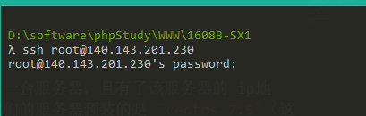

# 购买服务器

## 领取免费服务器

进入[进入腾讯云](https://cloud.tencent.com/?fromSource=gwzcw.2212127.2212127.2212127&utm_medium=cpd&utm_id=gwzcw.2212127.2212127.2212127)

点击免费注册按钮


微信扫码


根据自己的实际情况进行选择


进行实名认证


支付一分钱后，认证成功，并进入如下界面，点击免费套餐


选择个人免费套餐


在云服务器这里点击免费领取


按如图方式填写，并点击领取


## 查看服务器实例

进入该界面，点击控制台


此时自己已经拥有了一台服务器，点击云服务器


进入服务器控制界面


可进行修改密码


此时需要记住自己的三样东西

1. 服务器的公网ip地址，这个是我们之后进行远程连接，以及客户端访问的地址，非常重要  （远程连接时用）

2. 自己服务器的用户名  （远程连接时用）

3. 自己服务器的密码（远程连接时用）


# 远程服务器环境配置

此时，我们已经拥有了一台服务器，且有了该服务器的 ip地址、用户名、密码。我们的服务器预装的是 `centos 7.5`（这是linux系统的一个版本），一次必须要掌握linux系统的一些常用操作命令，有兴趣的同学可以自行百度。

## 连接

1. 打开 Cmder(必须是cmder或者xshell，否则不启作用)

2. 输入如下命令

```
ssh 服务器用户名@自己的服务器ip地址
```
如下图：


> 此时会要求输入密码，注意，此时输入密码不会有提示，保证输入正确就行

登录成功如下图：


## 在服务器中创建个人目录

在服务器登入成功后，可以创建个人目录，执行如下命令
```shell
cd ~
mkdir wt
ls -a
```

上述三条命令的意思是 
1. 进入用户根目录
2. 创建名为wt的目录
3. 查看用户根目录的所有内容

如下图，输入`ls -a`命令后，可以看到`wt`目录已经创建成功


进入`wt`目录,然后开始搭建自己的服务器环境

```shell
cd wt
```

## 安装node

此时已经进入到个人目录了，接下来我们学习如何在linux下安装node。

### 下载node 

执行如下命令
```shell
wget https://nodejs.org/dist/v10.15.3/node-v10.15.3-linux-x64.tar.xz
```

上述命令的意思是下载node的安装包，下载完毕后，输入`ls -a`命令，如下图


### 解压node

linux下的压缩包和windows下的压缩包有所不同，我们输入如下命令进行解压

```shell
xz -d node-v10.15.3-linux-x64.tar.xz
ls -a
tar -xvf node-v10.15.3-linux-x64.tar
ls -a
```
上述命令的意思

1. 解压xz模式的打包文件
2. 查看该目录下的文件
3. 解压tar格式的文件
4. 查看该目录下的文件

最后结果如下:


此时node已经安装成功了，但是当我们输入`node -v`的时候，不会有我们期望的结果，那么下边我们学习如何配置全局环境变量
> 小提示：如果文件的名字太长的话，可以先输入文件名开头的几个字母，然后按tab键，就可以自动补全文件名


### 验证node是否可用

先想第一个问题，此时node已经安装成功了，但是没有配置到全局去，那么至少我们在本地应该是能够使用的

我们进入node程序所在的目录

```shell
cd node-v10.15.3-linux-x64
cd bin
ls -a
```

此时，应该能看到如下图


接下来我们执行  
```shell
./node -v
```
会看到 node版本号，说明安装成功

### 把node配置到全局环境变量

现在我们把node配置到全局，就可以在任意的地方使用  `node -v`命令了

按照如下步骤操作

```shell
cd ~
ls -a
```
进入用户根目录，查看文件，找到 `.bash_profile`


接下来用`vim`工具打开该文件，打开的命令是`vim .base_profile`

打开界面如下 


> 有兴趣可自行搜索 vim的使用方法

现在按照如下步骤操作，先按一下 `ESC`键，然后按字母  `i`,此时


此时是可编辑状态，现在可以通过控制方向键去移动光标，到自己想要编辑的位置，进行编辑。

添加如下图的内容


修改完成后，再按`ESC`键，如下图


这个时候再输入  `:`,然后输入  `wq`,表示保存并退出，然后按回车


此时回到命令行界面，代表修改完成。现在关闭命令行，重新进入服务器，输入`node -v`可以看到版本号，配置成功


## 安装git

在服务器环境下输入如下命令

```shell
yum install git
```


输入`y`即可安装成功

然后输入`git --version `,如下图，则安装成功


## 安装phpStudy（集成 nginx+mysql+php的环境）

进入个人目录

```shell
cd ~/ryn
 
```
使用`wget http://lamp.phpstudy.net/phpstudy.bin`下载phpstudy


给该文件加权限

`chmod +x phpstudy.bin`

开始安装

`./phpstudy.bin`

开始漫长的等待。。。。


## 启动phpStudy

安装成功后，执行`phpstudy start`启动（mysql,nginx,php)

## 配置mysql为全局环境变量

把  `/phpstudy/mysql/bin`该目录添加到全局环境变量即可


